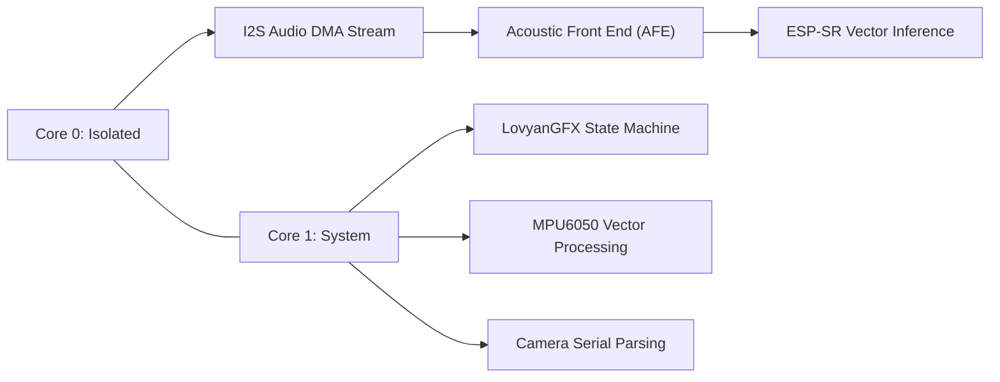

Tracking the complete software development lifecycle of the Companion Robot Project (2.1) has led to critical architectural breakthroughs. To support real-time user interactions without compromising physical system stability, the robot's architecture successfully transitioned from a standard, limited Arduino environment into an advanced dual-core ESP-IDF and Arduino hybrid framework.

By strategically isolating firmware tasks across both processing cores, the system completely eliminates kernel panics and high-frequency bus collisions. However, running a responsive voice interface alongside display graphics and physical sensor grids required moving beyond generic machine learning libraries to unlock raw hardware acceleration.

## Understanding ESP32-S3 Vector Instructions

What makes the ESP32-S3 a true powerhouse for localized Edge AI is its underlying silicon. The ESP32-S3 integrates the Xtensa LX7 processor core, which features a custom 128-bit SIMD (Single Instruction, Multiple Data) vector engine.

These specialized vector extensions allow the microcontroller to execute multiple mathematical operations concurrently within a single clock cycle. For intensive Edge AI workloads like Keyword Spotting (KWS), which depend heavily on matrix multiplications, deep convolutions, and Fast Fourier Transforms (FFT) to process audio spectrograms, these vector instructions provide a hardware-accelerated speedup of up to 10x compared to traditional scalar execution paths.


## ESP-SR (WakeNet) vs. Edge Impulse KWS

When choosing an embedded inference deployment engine, developers often default to generic toolchains. For instance, platforms like Edge Impulse compile neural network graphs into standard C++ arrays utilizing TensorFlow Lite for Microcontrollers (TFLite Micro). While highly accessible, this approach relies on generalized scalar instructions that compile model weights directly into the application's primary binary memory space, bloating the factory firmware footprint and inflating CPU overhead.

In contrast, Espressif's native ESP-SR (WakeNet) framework is explicitly handwritten in assembly to hook directly into the LX7 core's 128-bit vector registers. Furthermore, ESP-SR completely decouples the model architecture from the executable codebase by leveraging a dedicated 4MB flash partition (`model`). This keeps your main application binary compact, safe from memory overflows, and optimized for ultra-low latency processing loops.

### Architectural Framework Comparison


| Feature                      | Edge Impulse (TFLite Micro)                    | Native ESP-SR (WakeNet)                                 |
| :--------------------------- | :--------------------------------------------- | :------------------------------------------------------ |
| **Instruction Optimization** | Generalized scalar C++ routines                | Handwritten assembly targeting 128-bit vector registers |
| **Memory Allocation**        | Embedded directly into main application binary | Decoupled via a dedicated 4MB`model` flash partition    |
| **Processing Overhead**      | High CPU utilization due to sequential loops   | Low latency via concurrent SIMD execution paths         |
| **Firmware Impact**          | Bloats primary application binary size         | Highly compact main binary execution space              |

## The Multi-Core Architectural Blueprint

To maintain structural runtime stability, tasks are divided asynchronously across the FreeRTOS scheduling environment to isolate heavy calculation pipelines:

* **Core 0:** Locked and isolated entirely for the hardware-accelerated Acoustic Front End (AFE) audio streaming and vector-accelerated keyword inference loops.
* **Core 1:** Dedicated to running the LovyanGFX display rendering state machines, processing MPU6050 physical vector calculations, and parsing serial data packets from the camera system.

| **Memory Allocation**        | Embedded directly into main application binary | Decoupled via a dedicated 4MB `model` flash partition    |

To illustrate the runtime division of responsibilities between the two cores, here's a compact diagram (Mermaid):



## Our Architectural Implementation Roadmap

Transitioning the Companion Robot Project (2.1) to a native voice keyword spotting engine follows a structured deployment pipeline:

### 1. Dataset Collection

Record 50 to 100 clean audio sample iterations of your custom wake word. To prevent ingestion errors or sample-rate conversion distortion, ensure files are formatted strictly as **16kHz, 16-bit, Mono PCM .wav** files.

### 2. Model Compilation

Process your raw recording dataset through Espressif's local script pipelines. This optimization step structures the neural network weights specifically for the LX7 vector engine, producing a highly optimized, deployable `model.bin` file.

### 3. Flash Deployment

Use the command-line utility `esptool.py` to burn the compiled binary directly into the custom flash partition boundary mapping. This separates the asset data from active firmware code.

```bash
esptool.py --chip esp32s3 write_flash 0x300000 model.bin
```

### 4. Runtime Execution

Upon booting, the multi-core firmware executes a dynamic partition check. The framework automatically discovers the model layout via the native initialization call `esp_srmodel_init()`.

Once verified, the raw 16-bit mono microphone stream is fed straight via DMA into Core 0 for real-time vector acceleration. Core 1 continues to smoothly render the companion robot's interactive animation states and parse sensor vectors without a single millisecond of frame drops or latency penalties.

Kavishka Dulshan
